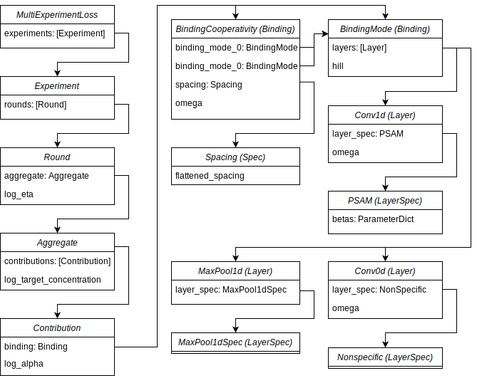

ProBound
========

Re-implementation of ProBound [#Rube2022]_ in PyTorch.

.. toctree::
   :hidden:

   CTCF
   CTCF_multiexp
   UbxExdHth
   CEBPg
   Dll
   GR
   Src

.. toctree::
   :hidden:

   api

Examples
--------
- :doc:`CTCF: Single Experiment <_notebooks/CTCF>`
- :doc:`CTCF: Multiple Experiments <_notebooks/CTCF_multiexp>`
- :doc:`UbxExdHth: Binding Cooperativity <_notebooks/UbxExdHth>`
- :doc:`CEBPγ: EpiSELEX-seq <_notebooks/CEBPg>`
- :doc:`Dll: Kd-seq <_notebooks/Dll>`
- :doc:`GR: ChIP-seq <_notebooks/GR>`
- :doc:`Src: Kinase-seq <_notebooks/Src>`

Overview
--------

Reference
----------
.. [#Rube2022] Rube, H.T., Rastogi, C., Feng, S. et al. Prediction of protein–ligand binding affinity from sequencing data with interpretable machine learning. Nat Biotechnol 40, 1520–1527 (2022). https://doi.org/10.1038/s41587-022-01307-0
